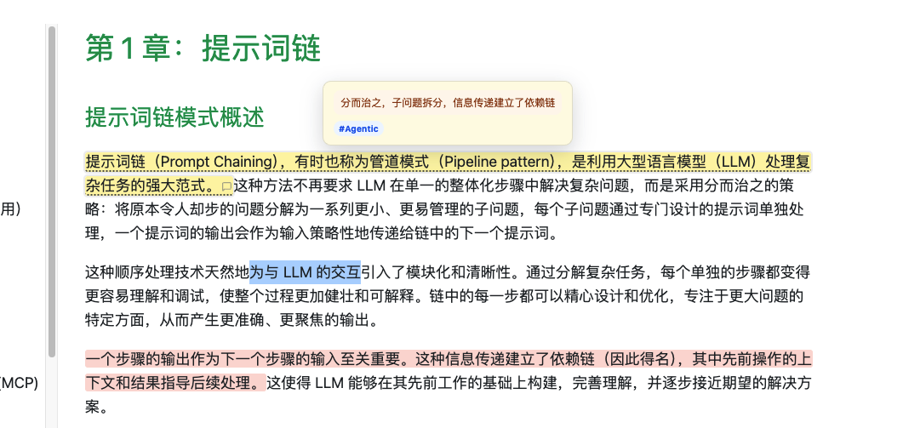
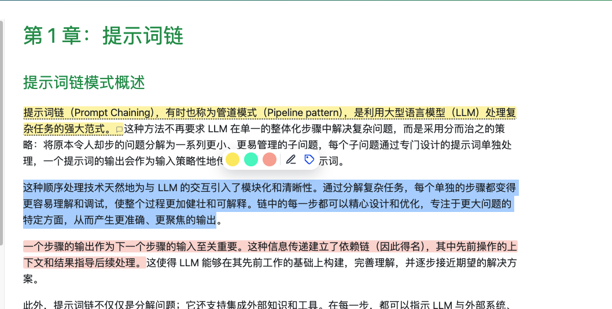
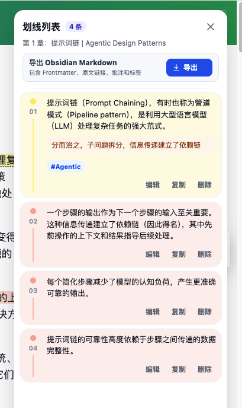

# Liucai

[简体中文](README.md) · [English](README.en.md)

Liucai is a Chrome extension for highlighting and annotating web pages. It is local-first: every local feature works without an account, while optional Supabase sign-in enables cloud backup and cross-device sync.

> Liucai is currently a development preview and must be installed as an unpacked extension.



## Features

- Three highlight colors: gold, mint, and coral
- Notes and tags for every highlight
- Hover previews for notes and tags
- Automatic highlight restoration after reopening a page
- A sidebar for locating, editing, copying, and deleting highlights
- Markdown export designed for Obsidian
- Per-site enable and disable controls
- Optional Supabase cloud backup and cross-device sync





## Local-first storage and sync

Highlights, notes, and tags are always committed to the extension's IndexedDB first. Local features continue to work while signed out, offline, or when Supabase is temporarily unavailable.

After sign-in, synchronization runs automatically:

- after sign-in, background startup, or opening a regular web page
- after creating, editing, or deleting a highlight
- every five minutes as a fallback check

You can also select **Sync now** in the popup. A new computer signed in to the same account downloads the cloud data and restores it locally. Local changes that have not reached Supabase cannot be recovered if the local database is deleted.

In the first release, one local database can be bound to only one Supabase account. This prevents the same local data from being uploaded to another account after sign-out.

## Installation

### Install from a GitHub Release

1. Download `liucai-extension-v<version>.zip` from the Releases page.
2. Extract the ZIP file.
3. Open `chrome://extensions/`.
4. Enable **Developer mode**.
5. Select **Load unpacked** and choose the extracted directory.

To upgrade, extract the new version and reload it from the extensions page. Normal extension upgrades do not delete saved data.

### Install from source

```bash
npm install
cp .env.example .env.local
npm run build
```

Set the Supabase Project URL and publishable key in `.env.local`, then load `dist/` in Chrome. Never use a secret or service role key in the client.

## Development

```bash
npm test
npm run typecheck
npm run build
npm run package
```

- `npm run build` creates `dist/`
- `npm run package` creates `artifacts/liucai-extension-v<version>.zip`
- The ZIP root contains `manifest.json` directly and excludes source maps

## GitHub CI and releases

The [CI workflow](.github/workflows/ci-release.yml) runs tests, type checking, builds, and packaging on `main`, `dev`, pull requests, and manual runs. It retains the resulting Actions Artifact for 14 days.

Pushing a tag that matches the version in `package.json`, such as `v0.1.0`, automatically creates or updates a GitHub Release and uploads the extension ZIP.

Before publishing a release with cloud sync, add these repository variables under **Settings → Secrets and variables → Actions → Variables**:

- `VITE_SUPABASE_URL`
- `VITE_SUPABASE_PUBLISHABLE_KEY`

## Current limitations

- Desktop Chrome and regular web page content only.
- PDF files, iframes, Shadow DOM, Google Docs, Lark Docs, Notion, and other complex pages are not guaranteed to work.
- Highlights may not be restored if the source page changes substantially.
- Cross-device changes are not pushed in real time; an idle device may take up to about five minutes to pull them.
- Local multi-account isolation and automatic Obsidian sync are not implemented yet.

## Data and security

- Local records are stored in IndexedDB under the extension origin.
- The Supabase session is stored in `chrome.storage.local` and is not exposed to page scripts.
- The client contains only a Supabase publishable key.
- Cloud writes use an authenticated RPC, with Row Level Security isolating user data.
