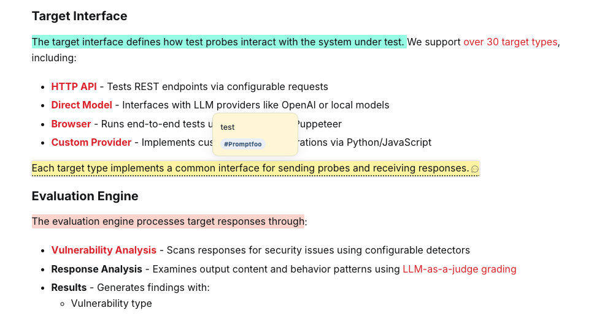
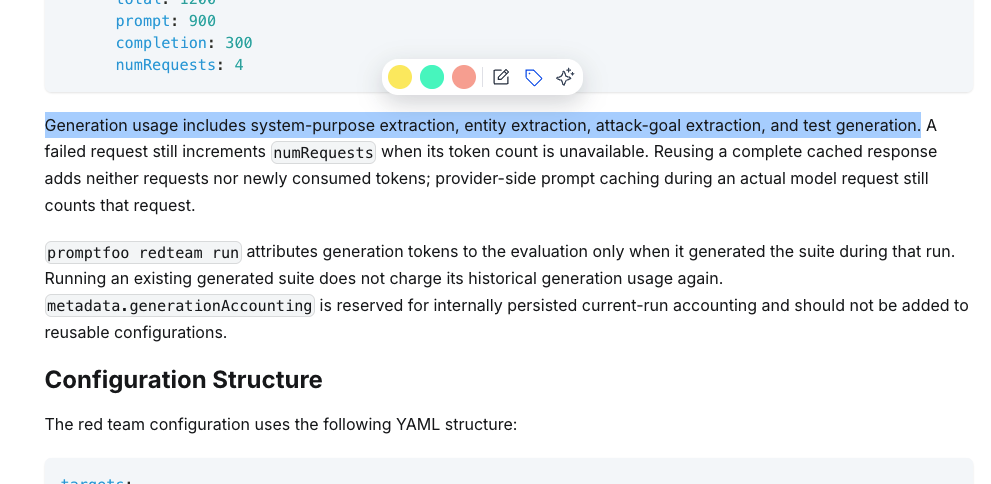
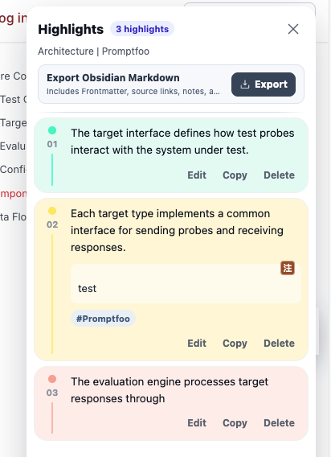
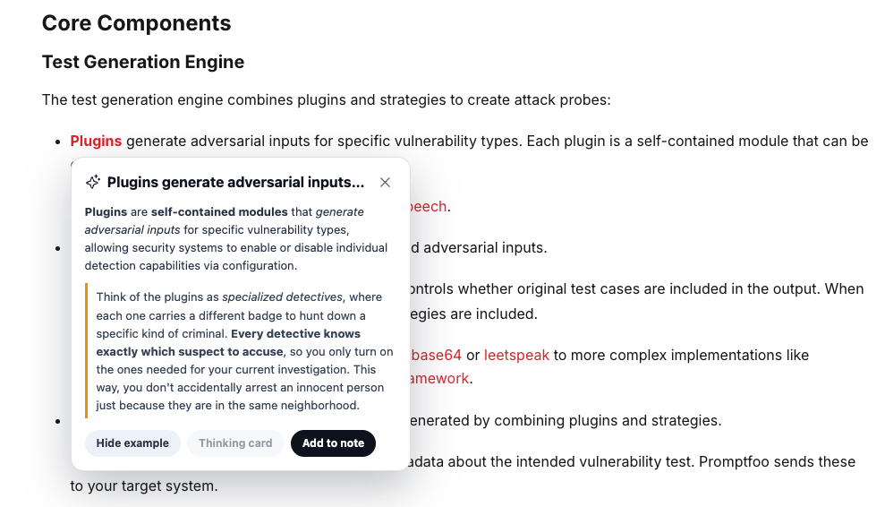

# Liucai

[简体中文](README.md) · [English](README.en.md)

Liucai is a Chrome extension for highlighting, annotating, and understanding web pages. It is local-first: core features such as highlighting, notes, and export work without an account. Signing in with Supabase adds cloud backup, cross-device sync, and AI understanding after a model service is configured.

> Liucai is currently a development preview and must be installed as an unpacked extension.



## Features

- Three highlight colors: gold, mint, and coral
- Notes and tags for every highlight
- Hover previews for notes and tags
- Automatic highlight restoration after reopening a page
- Separate toolbars for a new selection, an existing highlight, and a selection inside a highlight
- A sidebar for locating, editing, copying, and deleting highlights
- Markdown export designed for Obsidian
- Streaming AI explanations and everyday examples for selected text after sign-in, with an option to add them to notes
- Settings for English or Chinese UI, the default highlight color, and model connections
- Per-site enable and disable controls
- Optional Supabase cloud backup and cross-device sync





## AI understanding

After signing in, select text in regular page content or inside an existing highlight and choose AI from the toolbar. Liucai streams a concise explanation grounded in the nearby context and supports basic Markdown emphasis. You can then request a familiar everyday analogy or add the explanation and example to a note.



AI requests run only after an explicit click. Selecting or hovering over text and opening a page never sends page content automatically. Liucai currently connects directly to either:

- LM Studio or another local service compatible with the OpenAI Responses API
- the official OpenAI service or a compatible HTTPS service

Configure the endpoint, model ID, and credentials in Settings, where you can test the connection first. Quick explanations and examples run without reasoning to favor responsiveness. **Thinking card** remains a disabled placeholder for a future feature.

## Settings

Open Settings from the button in the popup header to manage preferences across pages:

- interface language: follow the browser, Simplified Chinese, or English
- the default highlight color used when creating a note or tag
- LM Studio and OpenAI-compatible model connections

The language preference applies to the popup, Settings, page toolbars, note editor, and highlights sidebar.

## Local-first storage and sync

Highlights, notes, and tags are always committed to the extension's IndexedDB first. Local features continue to work while signed out, offline, or when Supabase is temporarily unavailable.

After sign-in, synchronization runs automatically:

- after sign-in, background startup, or opening a regular web page
- after creating, editing, or deleting a highlight
- every five minutes as a fallback check

You can also select **Sync now** in the popup. A new computer signed in to the same account downloads the cloud data and restores it locally. Local changes that have not reached Supabase cannot be recovered if the local database is deleted.

In the first release, one local database can be bound to only one Supabase account. This prevents the same local data from being uploaded to another account after sign-out.

## Installation

### Install from a GitHub Release

1. Download `liucai-extension-v<version>.zip` from the Releases page.
2. Extract the ZIP file.
3. Open `chrome://extensions/`.
4. Enable **Developer mode**.
5. Select **Load unpacked** and choose the extracted directory.

To upgrade, extract the new version and reload it from the extensions page. Normal extension upgrades do not delete saved data.

### Install from source

```bash
npm install
cp .env.example .env.local
npm run build
```

To use cloud sync, set the Supabase Project URL and publishable key in `.env.local`. Local highlighting and notes still work without them. After building, load `dist/` in Chrome. Never use a secret or service role key in the client.

## Development

```bash
npm test
npm run typecheck
npm run build
npm run package
```

- `npm run build` creates `dist/`
- `npm run package` creates `artifacts/liucai-extension-v<version>.zip`
- The ZIP root contains `manifest.json` directly and excludes source maps

## Current limitations

- Desktop Chrome and regular web page content only.
- PDF files, iframes, Shadow DOM, Google Docs, Lark Docs, Notion, and other complex pages are not guaranteed to work.
- Highlights may not be restored if the source page changes substantially.
- Cross-device changes are not pushed in real time; an idle device may take up to about five minutes to pull them.
- AI is available only to signed-in users and requires a model service that supports the OpenAI Responses API.
- Thinking cards and recall masks are not implemented yet.
- Local multi-account isolation and automatic Obsidian sync are not implemented yet.

## Data and security

- Local records are stored in IndexedDB under the extension origin.
- The Supabase session and model connection settings are stored in `chrome.storage.local` and are not written into the page DOM.
- The client contains only a Supabase publishable key.
- Cloud writes use an authenticated RPC, with Row Level Security isolating user data.
- When AI is used, Liucai sends the selected text and nearby context directly to the configured model service. It does not send the page title or URL.
- The OpenAI API key is stored locally in the current browser. Direct use from a browser extension risks exposing the key, so use a separate key with a spending limit.
