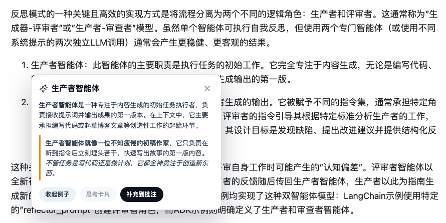

# 六彩 Liucai

[简体中文](README.md) · [English](README.en.md)

六彩是一款 Chrome 网页高亮、批注与辅助理解扩展。它以本地数据为核心：高亮、批注和导出等核心功能无需登录；登录 Supabase 后，可将数据备份到云端、在多台电脑之间同步，并在配置模型服务后使用 AI 理解。

> 当前处于开发预览阶段，仅支持通过“加载已解压的扩展程序”安装。


## 功能

- 三种高亮颜色：暖黄、薄荷、珊瑚
- 为高亮添加批注和标签
- 悬停查看批注与标签
- 页面刷新或重新打开后自动恢复高亮
- 区分首次划选、点击已有高亮和高亮内再次划选三种工具条
- 右侧划线列表支持定位、编辑、复制和删除
- 导出适合 Obsidian 的 Markdown
- 登录后可对选中文字生成流式 AI 轻解释和生活化例子，并补充到批注
- 设置页支持中英文界面、默认高亮颜色以及模型连接配置
- 按域名禁用或恢复划线功能
- 可选的 Supabase 云备份与跨设备同步


## AI 理解

登录后，在普通正文或已有高亮内选中文字，即可从工具条打开 AI 轻解释。解释会结合选区附近的上下文流式显示，并支持基础 Markdown 强调。需要更直观时，可以继续生成一个面向日常概念的生活化例子；解释和例子也可以补充到批注。



AI 只在主动点击后请求，不会因划选、悬停或打开页面自动发送正文。目前支持两种由扩展直接连接的模型服务：

- 本机 LM Studio 或其他兼容 OpenAI Responses API 的本地服务
- OpenAI 官方服务或兼容的 HTTPS 服务

模型地址、模型 ID 和凭据在设置页中配置，并可先测试连接。轻解释和例子使用无推理模式，以优先保证响应速度；“思考卡片”目前是禁用的后续能力。

## 设置

点击 Popup 右上角的设置按钮，可以管理跨页面生效的偏好：

- 界面语言：跟随浏览器、简体中文或 English
- 创建批注或标签时使用的默认高亮颜色
- LM Studio 与 OpenAI 兼容模型服务

语言偏好会同时应用到 Popup、设置页、划线工具条、批注弹窗和右侧栏。

## 本地优先与云同步

高亮、批注和标签始终先写入扩展自己的 IndexedDB，不等待网络请求。未登录、断网或 Supabase 暂时不可用时，本地功能仍然正常。

登录后，同步会在以下时机自动运行：

- 登录、扩展后台启动或打开普通网页时
- 新增、修改或删除高亮后
- 每 5 分钟进行一次兜底检查

也可以在 Popup 中点击“立即同步”。新电脑登录同一账号后，会从 Supabase 下载云端数据并恢复到本地。尚未上传成功的本地数据如果被删除，则无法从云端恢复。

访客与每个 Supabase 账号的高亮、批注、待同步队列和同步游标分别保存在独立的 IndexedDB 中。退出或切换账号时，扩展会切换到对应的本地数据库，不会跨账号共用内容数据。升级前已经绑定账号的旧数据库会自动复制到该账号的新数据库；旧库保留为可恢复副本。界面偏好、站点开关和模型连接配置仍是当前浏览器级设置。

## 安装

### 从 GitHub Release 安装

1. 在 Releases 页面下载 `liucai-extension-v<version>.zip`。
2. 解压 ZIP。
3. 打开 `chrome://extensions/`。
4. 开启“开发者模式”。
5. 点击“加载已解压的扩展程序”，选择解压后的目录。

升级版本时，重新解压并在扩展管理页点击刷新；已保存的数据不会因普通升级而删除。

### 从源码安装

```bash
npm install
cp .env.example .env.local
npm run build
```

如需云同步，在 `.env.local` 中填写 Supabase Project URL 和 publishable key；未配置时仍可使用本地高亮与批注。构建完成后，在 Chrome 中加载 `dist/`。客户端不得使用 secret 或 service role key。

## 开发

```bash
npm test
npm run typecheck
npm run build
npm run package
```

- `npm run build`：生成 `dist/`
- `npm run package`：生成 `artifacts/liucai-extension-v<version>.zip`
- ZIP 根目录直接包含 `manifest.json`，不包含 source map

`src/` 根目录只保留 background、content、popup、options 构建入口及其样式；内部模块按职责放在：

- `content/`：页面生命周期、交互、DOM 与内容 UI
- `storage/`：IndexedDB 与 content/background 存储协议
- `sync/`：Supabase 客户端和同步协议
- `ai/`：模型请求、流式响应和 AI 批注
- `settings/`：模型与站点设置
- `shared/`：跨入口共享的类型、消息、偏好和本地化

## 当前限制

- 仅支持桌面版 Chrome 和普通网页正文。
- 暂不保证支持 PDF、iframe、Shadow DOM、Google Docs、飞书文档、Notion 等复杂页面。
- 页面内容大幅变化后，保存的文本位置可能无法恢复。
- 跨设备变化不是实时推送；空闲设备最多约 5 分钟后拉取。
- AI 仅对登录用户开放，并要求模型服务支持 OpenAI Responses API。
- 思考卡片和回忆遮罩尚未实现。
- 尚未实现访客数据导入账号和 Obsidian 自动同步。

## 数据与安全

- 本地数据保存在扩展 origin 的 IndexedDB 中。
- Supabase 会话和模型连接设置保存在 `chrome.storage.local`，不会写入网页正文 DOM。
- 客户端只包含 Supabase publishable key。
- 云端写入通过认证 RPC 完成，用户数据由 Row Level Security 隔离。
- 使用 AI 时，扩展会将选中文字和附近上下文直接发送给用户配置的模型服务，不发送页面标题和 URL。
- OpenAI API Key 保存在当前浏览器本地。浏览器扩展直连存在密钥暴露风险，建议使用独立且受限额的 Key。
